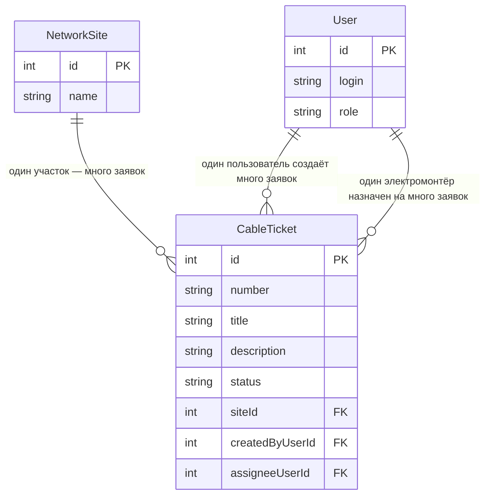

# Модель данных

## 1. Термины курса → термины темы

| Термин курса | Термин моей темы |
|---|---|
| Ticket | Заявка на повреждение кабеля (`CableTicket`) |
| Site | Участок сети (`NetworkSite`) |
| User | Пользователь (`User`) |
| Создаёт | Диспетчер сетей |
| Исполняет | Электромонтёр |

## 2. Сущности и поля

### CableTicket — заявка на повреждение кабеля
| Поле | Тип | Ключ | Описание |
|---|---|---|---|
| id | int | PK | машинный идентификатор |
| number | string | | человеческий номер («КБ-104») |
| title | string | | заголовок, 5–80 символов |
| description | string | | описание, 10–500 символов |
| status | string | | New, InProgress, Closed, Cancelled |
| siteId | int | FK → NetworkSite.id | участок сети |
| createdByUserId | int | FK → User.id | кто создал (диспетчер) |
| assigneeUserId | int, NULL | FK → User.id | электромонтёр; при создании пусто |

### NetworkSite — участок сети (справочник)
| Поле | Тип | Ключ | Описание |
|---|---|---|---|
| id | int | PK | идентификатор |
| name | string | | название участка |

### User — пользователь
| Поле | Тип | Ключ | Описание |
|---|---|---|---|
| id | int | PK | идентификатор |
| login | string | | логин |
| role | string | | Dispatcher / Electrician |

## 3. ER-диаграмма

## 4. Связи словами

- Один участок сети — много заявок. Название участка хранится
  один раз в NetworkSite, в заявке — только siteId.
- Один пользователь создаёт много заявок (createdByUserId).
- Один электромонтёр может быть назначен на много заявок
  (assigneeUserId).
- У новой заявки исполнитель может отсутствовать
  (assigneeUserId = NULL), пока диспетчер не назначит.

## 5. Проверка 3НФ

Название участка сети хранится в сущности NetworkSite один раз.
Заявка CableTicket содержит только внешний ключ siteId.
При переименовании участка меняется одна строка в справочнике,
а не десятки заявок. Поэтому текст названия в заявках не
дублируется — третья нормальная форма соблюдена.
